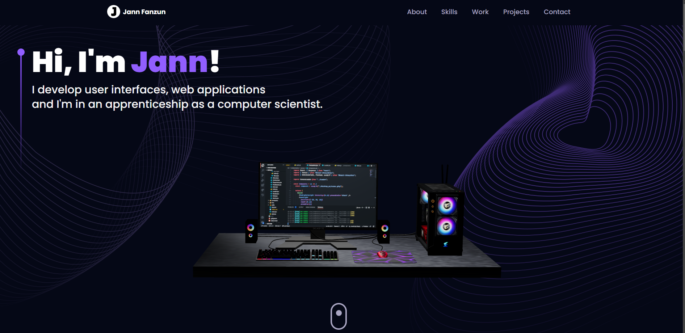

# final project ZLI 💻

For my final project in ZLI, I developed a portfolio website using React, Tailwind CSS, and Three.js.



### 📄 Inhaltsverzeichnis

- [final project ZLI 💻](#final-project-zli-)
    - [📄 Inhaltsverzeichnis](#-inhaltsverzeichnis)
    - [🔎 Link:](#-link)
    - [🧨 Installation](#-installation)
    - [🚀 Usage](#-usage)
    - [📐 Functions](#-functions)
    - [👾 Technologies](#-technologies)
    - [✔ License](#-license)

### 🔎 Link:

https://jannfanzun.vercel.app/
### 🧨 Installation

1. Clone the repository: `git clone https://github.com/jannfanzun/ZLI_Abschlussprojekt_23.git`
2. Switch to the project directory: `cd .\ZLI_Abschlussprojekt_23\`
3. Install the dependencies: `npm install vite` && `npm install`

### 🚀 Usage

1. Starte das Terminal und run die Applikation: ```npm run dev```
2. Open your web browser and go to: `http://localhost:xxxx` _**(the localhost address may vary for each person)**_

### 📐 Functions

- On the website, you can interact with the 3D elements using your mouse.
  - **Left mouse** button: Rotate
  - **Right mouse** button: Move
- You can use the navigation bar to navigate through the website.
- For example, under the "**Projects**" section, you can click on the links within the icons.
- You can send me a message through the contact form.

### 👾 Technologies 

- _**_React_**_: A JavaScript library for building user interfaces.
- _**_Three.js_**_: A cross-platform JavaScript library for creating 3D graphics in web browsers.
- _**_Three Fiber_**_: An extension for Three.js that makes it easier to develop 3D applications in React.
- _**_Framer Motion_**_: A React animation library for creating engaging animations on the website.
- _**_Tailwind CSS_**_: A CSS framework that uses pre-built classes to style the design and layout of the website.
- _**_Email.js_**_: A JavaScript library for easy integration of email sending functionality into the website.

### ✔ License

This project is protected by copyright and is subject to the relevant rights.

**_by Jann Fanzun_**